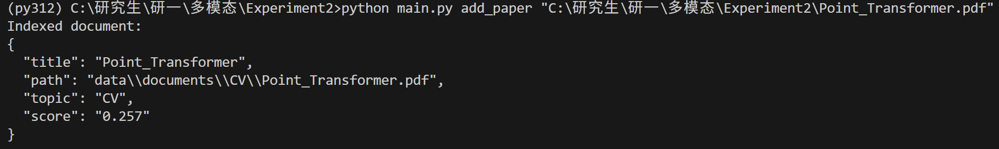
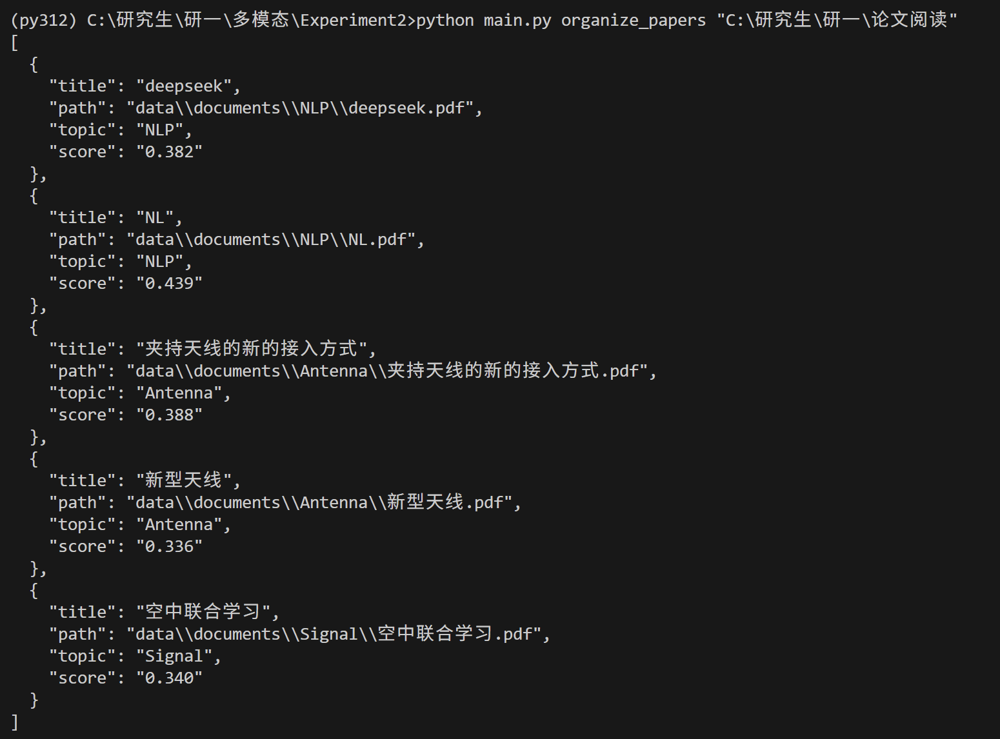
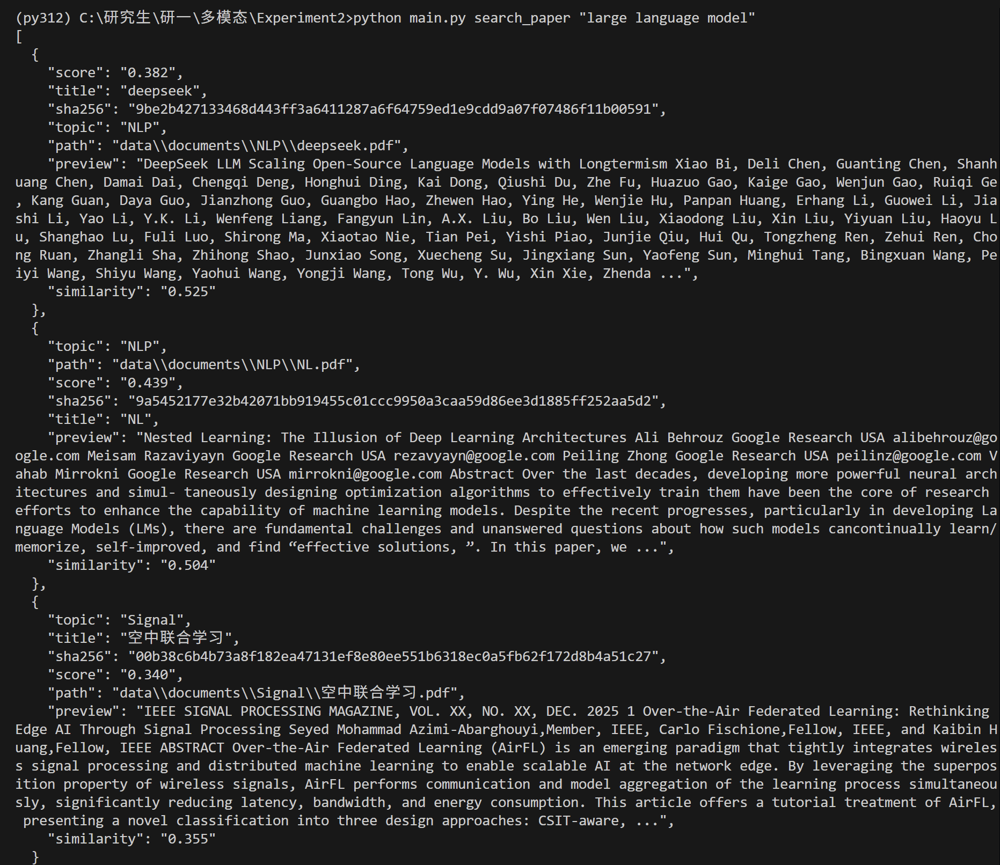
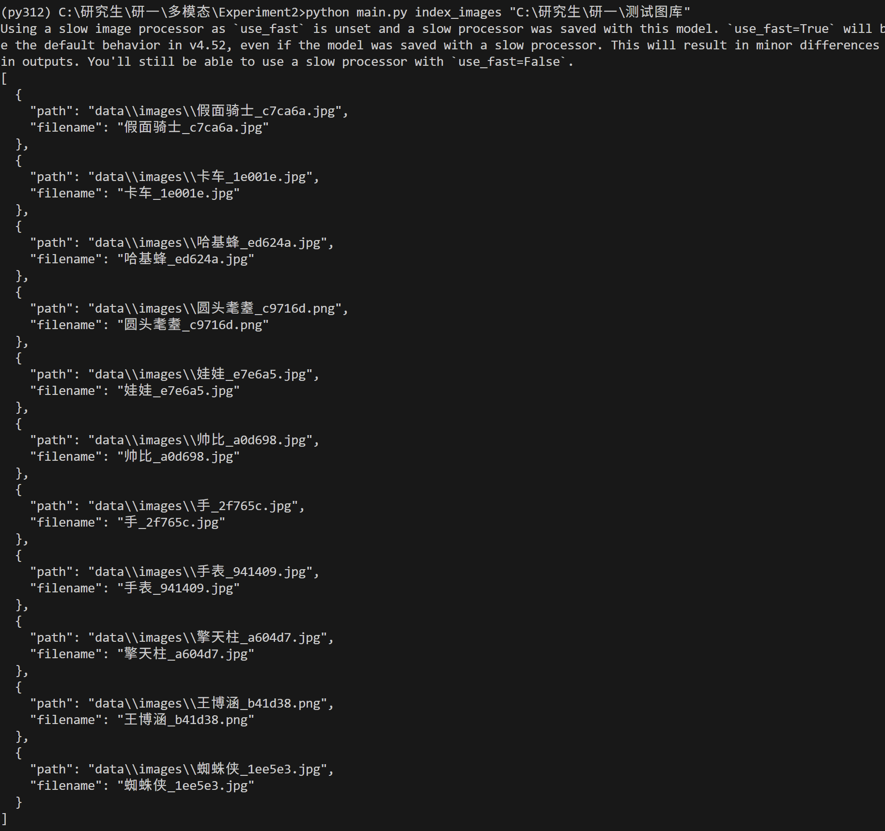
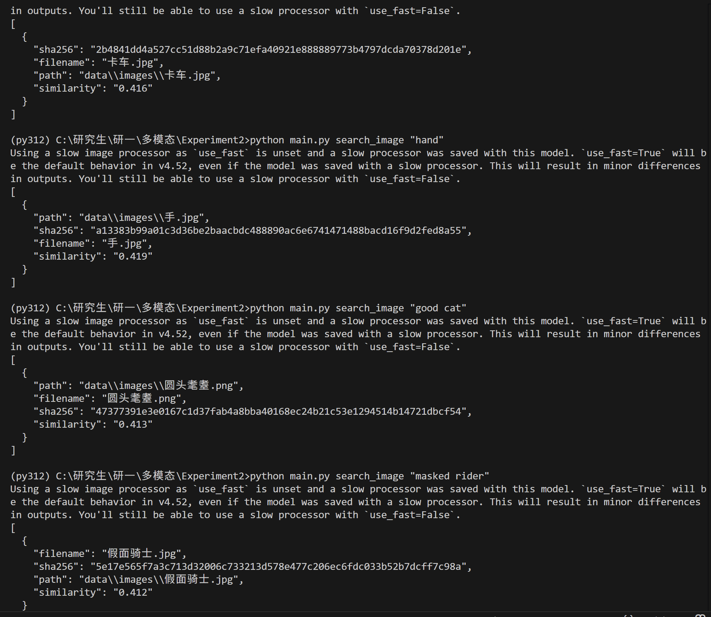

# Local Multimodal AI Agent

本项目为本地多模态 AI 助手，支持论文与图像的语义检索、自动分类与整理。系统采用模块化设计，可替换不同嵌入模型与向量数据库，满足本地离线使用需求。

## 1. 项目简介与核心功能

**目标**：为本地论文与图片素材提供语义级检索与自动归类。

**核心功能**：
- 论文语义检索：使用自然语言查询返回最相关论文列表与预览片段。
- 论文自动分类与整理：单篇或批量导入后自动分到主题目录。
- 以文搜图：使用自然语言描述检索本地图片。
- 去重与阈值控制：支持文档/图片索引去重，检索结果按相似度阈值过滤。

## 2. 环境配置与依赖安装

**系统要求**：
- Windows / macOS / Linux
- Python 3.8+

**安装步骤**：
```bash
python -m venv .venv
.venv\Scripts\activate        # Windows
source .venv/bin/activate     # macOS / Linux

pip install --upgrade pip
pip install -r requirements.txt
```

**目录说明**：
- `data/documents`：分类后的论文库
- `data/images`：索引后的图片库
- `storage/chroma`：向量数据库持久化目录

## 3. 详细使用说明（命令行示例）

### 3.1 论文管理

**单篇论文分类**
```bash
python main.py add_paper "C:\path\paper.pdf" --topics "CV,NLP,RL,Multimodal"
```


**批量整理目录**
```bash
python main.py organize_papers "C:\path\papers"
```


**语义检索**
```bash
python main.py search_paper "Transformer 的核心架构是什么？"
```


### 3.2 图像管理

**索引图库**
```bash
python main.py index_images "C:\path\images"
```


**以文搜图**
```bash
python main.py search_image "sunset by the sea" --top_k 5
```


### 3.3 配置与阈值

配置文件位置：`config/default_config.yaml`

```yaml
paths:
  document_library: data/documents
  image_library: data/images
  vector_store_path: storage/chroma
models:
  text_embedding: sentence-transformers/all-MiniLM-L6-v2
  clip_model: openai/clip-vit-base-patch32
classification:
  threshold: 0.2
  uncategorized_folder: Uncategorized
retrieval:
  threshold: 0.35
  image_threshold: 0.4
```

说明：
- `classification.threshold`：论文分类阈值，低于阈值会被放到 `Uncategorized`
- `retrieval.threshold`：论文检索返回阈值
- `retrieval.image_threshold`：图像检索返回阈值

## 4. 技术选型说明

**文本嵌入**：`sentence-transformers`
**图像嵌入**：`CLIP`（HuggingFace Transformers）
**向量数据库**：`ChromaDB`
**PDF 解析**：`pypdf`

可替换配置路径与模型：
- 修改 `config/default_config.yaml` 中的 `models.text_embedding` / `models.clip_model`
- 使用 `--config` 指定自定义配置文件

## 5. 目录结构

```
Experiment2/
  agent/
    __init__.py
    config.py
    document_manager.py
    image_manager.py
    topic_classifier.py
    embeddings/
      base.py
      clip_embedding.py
      text_embedding.py
    storage/
      vector_store.py
    utils/
      files.py
      pdf.py
  config/
    default_config.yaml
    topics.yaml
  data/
    documents/            # 运行时生成，存放分类后的论文
    images/               # 运行时生成，存放索引后的图像
  storage/
    chroma/               # 运行时生成，ChromaDB 持久化数据
  docs/
    add_papers.png
    organize_papers.png
    search_paper.png
    index_image.png
    search_image.png
  .gitignore
  main.py
  requirements.txt
  README.md
```
